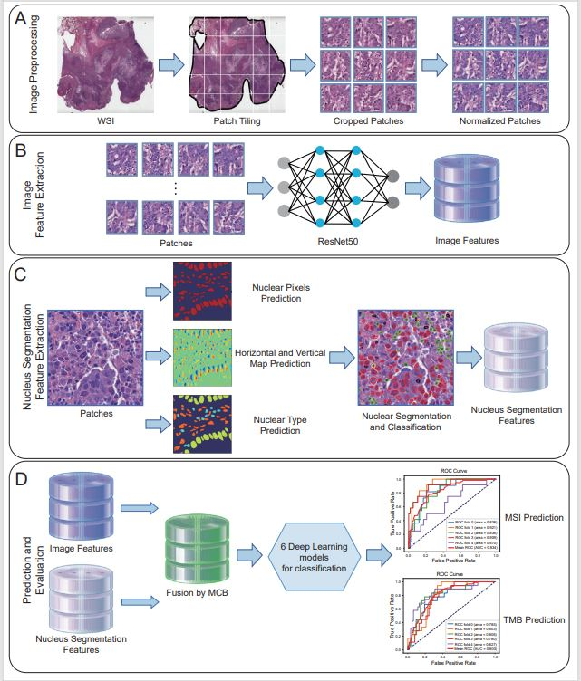

# Deep Learning-Based Fusion of Nuclear Segmentation Features for Microsatellite Instability and Tumor Mutational Burden Prediction in Digestive Tract Cancers: A Multi-Center Validation Study

<details>
<summary>
        <b>Deep Learning-Based Fusion of Nuclear Segmentation Features for Microsatellite Instability and Tumor Mutational Burden Prediction in Digestive Tract Cancers: A Multi-Center Validation Study.</b>
</summary>

**Abstract:** Microsatellite instability (MSI) and tumor mutational burden (TMB) are vital prognostic biomarkers for personalized treatment in gastric cancer (GC) and colorectal cancer (CRC). Conventional sequencing-based assays for MSI and TMB remain prohibitively expensive and time-consuming. Furthermore, only approximately 20% of patients exhibit MSI-high (MSI-H) or TMB-high (TMB-H) status – the subgroups most likely to benefit from immunotherapy. Consequently, the high cost of comprehensive gene sequencing is largely unwarranted for the majority of patients, limiting the broad clinical utility of MSI and TMB testing. Therefore, developing cost-effective alternatives using routinely available hematoxylin and eosin (H&E)-stained tissue sections is imperative to identify patients who require further confirmatory genomic analysis. This study introduces a novel deep learning framework that predicts MSI and TMB status directly from H&E-stained images using fused nuclear segmentation features. We analyzed 350 GC and 376 CRC samples for MSI prediction, and 400 GC and 387 CRC samples for TMB prediction, sourcing data from TCGA and subjecting it to comprehensive preprocessing. Image features were extracted using the CLAM model, while nuclear segmentation features were obtained through the Hover-Net model. These features were combined via Multimodal Compact Bilinear Pooling (MCB) and utilized in six distinct deep learning models. By fusing the nucleus segmentation features, the model demonstrated enhanced predictive performance during 5-fold cross-validation, achieving an average increase of 1-3% in the area under the receiver operating characteristic curve (AUC) and 5-11% in recall, significantly outperforming models that relied solely on image features. External validation on a CRC dataset from the China-Japan Friendship Hospital further validated the model’s robustness, achieving an AUC of 0.81 and a recall of 0.80 for MSI prediction. Additionally, notable differences in cellular composition were observed across cancer types and clinical groups, emphasizing the pivotal role of cellular features in cancer development. These findings highlight the advantages of integrating H&E-stained image features with nuclear segmentation data and advanced deep learning techniques to improve predictive accuracy, potentially advancing personalized cancer treatment strategies. This method is expected to reduce the cost of MSI/TMB testing and promote the sinking of precision medicine resources.

</details>



## Data Preprocess

we follow the CLAM's WSI processing solution (https://github.com/mahmoodlab/CLAM)

```bash
# WSI Segmentation and Patching
python create_patches_fp.py --source DATA_DIRECTORY --save_dir RESULTS_DIRECTORY --patch_size 256 --preset bwh_biopsy.csv --seg --patch --stitch

# Feature Extraction
CUDA_VISIBLE_DEVICES=0,1 python extract_features_fp.py --data_h5_dir DIR_TO_COORDS --data_slide_dir DATA_DIRECTORY --csv_path CSV_FILE_NAME --feat_dir FEATURES_DIRECTORY --batch_size 512 --slide_ext .svs
```

We use HoverNet for cell nucleus extraction (https://github.com/vqdang/hover_net), run the following command:
```
parent_dir='/path/to/test_dataset'

python run_infer.py \
--gpu='0' \
--nr_types=6 \
--type_info_path=type_info.json \
--batch_size=32 \
--model_mode=fast \
--model_path=hovernet_fast_pannuke_type_tf2pytorch.tar \
--nr_inference_workers=6 \
--nr_post_proc_workers=6 \
tile \
--input_dir="$parent_dir/tiles" \
--output_dir="$parent_dir/Hovernet_output" \
--mem_usage=0.1 \
--draw_dot \
--save_qupath
```
To be consistent with our study, please use model_path=hovernet_fast_pannuke_type_tf2pytorch.tar from PanNuke checkpoint. Note that HoVer-Net framework can be replaced with other cell segmentation and classification models as required, however since the following feature extraction scripts are based on HoVer-Net based output, that's why those scripts would need to be modifed as well.


### Train & Test
```
python main1.py --distill_type AFS --dataset_path /home/hjy/dtfd-pt/STAD/DTFD-MIL-image/COAD-TMB/
```

